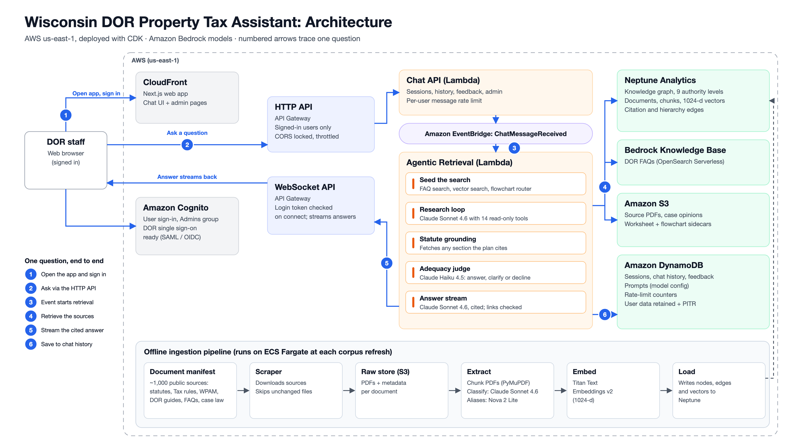

# Collaboration

Thanks for your interest in our solution. Having specific examples of replication and cloning allows us to continue to grow and scale our work. If you clone or download this repository, kindly shoot us a quick email to let us know you are interested in this work!

[wwps-cic@amazon.com]

---

# Disclaimers 

Customers are responsible for making their own independent assessment of the information in this document. 

This document: 

(a) is for informational purposes only, 

(b) references AWS product offerings and practices, which are subject to change without notice, 

(c) does not create any commitments or assurances from AWS and its affiliates, suppliers or licensors. AWS products or services are provided "as is" without warranties, representations, or conditions of any kind, whether express or implied. The responsibilities and liabilities of AWS to its customers are controlled by AWS agreements, and this document is not part of, nor does it modify, any agreement between AWS and its customers, and 

(d) is not to be considered a recommendation or viewpoint of AWS. 

Additionally, you are solely responsible for testing, security and optimizing all code and assets on GitHub repo, and all such code and assets should be considered: 

(a) as-is and without warranties or representations of any kind, 

(b) not suitable for production environments, or on production or other critical data, and 

(c) to include shortcuts in order to support rapid prototyping such as, but not limited to, relaxed authentication and authorization and a lack of strict adherence to security best practices. 

All work produced is open source. More information can be found in the GitHub repo.
# Wisconsin DOR Chatbot

A property tax Q&A assistant for the Wisconsin Department of Revenue (DOR). Users ask natural-language questions about property assessment, Wisconsin statutes, administrative rules, and DOR policy — the system retrieves authoritative sources from a knowledge graph and streams cited answers in real time.

## Architecture



Source: [`docs/architecture/architecture.svg`](docs/architecture/architecture.svg), generated by
[`docs/architecture/make_svg.py`](docs/architecture/make_svg.py). Edit the script and regenerate
when the architecture changes.

### How a Query Flows

1. The user opens the Next.js app (CloudFront) and signs in with Cognito.
2. The question goes to the **HTTP API** (Cognito JWT required, CORS locked to the app, throttled)
   and the **Chat API Lambda**, which checks session ownership and the per-user rate limit, then
   publishes `ChatMessageReceived` to EventBridge.
3. EventBridge triggers the **Agentic Retrieval Lambda** directly (no Step Function).
4. The Lambda retrieves:
   - **Seeds:** a Bedrock FAQ Knowledge Base search and an initial `vector_search` run before the
     first model turn; a semantic router may also seed a WPAM decision flowchart.
   - **Research loop (Phase A):** Claude Sonnet 4.6 calls the 14 read-only tools (`vector_search`,
     `search_document`, `list_sections`, `get_section`, `get_neighbors`, `find_case_law`, …) over
     Neptune Analytics, S3 sidecars and case opinions, until `prepare_answer` names the documents
     to cite.
   - **Statute grounding:** any statute section the plan cites but never retrieved is fetched,
     so its conditions and exceptions reach the next two steps.
   - **Adequacy judge:** Claude Haiku 4.5 reads the plan against every retrieved chunk and returns
     ANSWER, CLARIFY or DECLINE. A CLARIFY also sends clarification chips.
5. **Phase B** streams the cited answer over the **WebSocket API** (the connection is opened with
   the user's Cognito token and bound only to a session they own), with citation links repaired
   and invented URLs cut back to the site.
6. The turn is saved to DynamoDB chat history.

Documents reach the graph through the **offline ingestion pipeline** on ECS Fargate (bottom of
the diagram): manifest → scraper → S3 → extract → embed (Titan v2) → load (Neptune).

### Key Components

| Component | Description |
|-----------|-------------|
| **Frontend** (`frontend/`) | Next.js app served via CloudFront. Real-time streaming via WebSocket, Cognito auth, Zustand state management. |
| **Agentic Retrieval** (`backend/lambdas/agentic_retrieval/`) | Core retrieval engine — a 14-tool Claude loop backed by Neptune Analytics vector search and graph traversal, a post-retrieval adequacy judge, and the answer stream. Also delivers documents, FAQs and flowcharts to the frontend over WebSocket. |
| **Chat API** (`backend/lambdas/chat_api/`) | REST endpoints for sessions, chat history, feedback, and the `Admins`-gated `/admin/*` routes. Publishes `ChatMessageReceived` to EventBridge. |
| **WebSocket Handlers** (`backend/lambdas/websocket/`) | Connect / disconnect / default WebSocket route handlers. `$connect` verifies the Cognito ID token and binds the connection only to a session the caller owns. |
| **Neptune Analytics** | Knowledge graph storing framework, document and chunk nodes (1024-dim vector embeddings) under a 9-level authority hierarchy (Constitution → Statutes → Case Law → Admin Rules → WPAM → FAQs → Gov Pubs → IAAO → USPAP). Pinned by the `neptuneGraphId` CDK context, not created by CDK. |
| **Worksheets & flowcharts** (`tools/ingestion/{worksheets,flowcharts}/`) | TID `.xlsx` forms and WPAM decision charts, served from S3 JSON sidecars through dedicated tools instead of the graph. |
| **Sessions** (`infra/stacks/sessions-stack.ts`) | Cognito user pool (and optional DOR SSO, off by default), HTTP API, WebSocket API, DynamoDB sessions + chat history (retained, with point-in-time recovery) and the per-user rate-limit table. |
| **Infrastructure** (`infra/`) | CDK stacks. Entry point: `infra/bin/wisconsin-app.ts`. See [`infra/README.md`](infra/README.md). |

## Project Layout

```
├── backend/
│   ├── lambdas/          # Python Lambda functions
│   │   ├── agentic_retrieval/   # Claude tool-use loop + WebSocket streaming
│   │   ├── chat_api/            # REST chat initiation → EventBridge
│   │   └── websocket/           # Connect/disconnect/default handlers
│   └── layers/           # Shared Lambda layers
│       ├── step_function_types/ # Pydantic models for inter-Lambda contracts
│       └── websocket_utils/     # WebSocket connection management + message models
├── frontend/             # Next.js application (CloudFront-served)
├── infra/                # CDK stacks (TypeScript)
│   ├── bin/              # CDK app entry point (wisconsin-app.ts)
│   ├── lib/              # shared helpers (retrieval-config.ts)
│   └── stacks/           # stack (root), sessions, graphrag, graphrag-messages,
│                         #   webapp, ingestion, lambda-layers, cloudwatch-iam
├── tools/                # Ingestion pipeline + build tooling
│   ├── ingestion/        # scrape, extract, embed, load, case law
│   │   ├── chunking/     # PDF extraction + chunking library
│   │   ├── config/       # ingest_config.yaml + document_manifest.yaml
│   │   ├── ops/          # one-shot maintenance scripts
│   │   ├── scripts/      # Fargate run wrappers + FAQ sync
│   │   └── docker/       # ingestion container image
│   ├── bundle.py         # Lambda bundling script
│   └── upload_model_configs.py  # push prompts to DynamoDB
├── config/               # Shared config (model prompts, inference params)
├── docs/                 # Engineering documentation
└── bundles.toml          # Lambda bundling manifest
```

## Development

### Prerequisites

- [Bun](https://bun.sh) >= 1.2.19
- [uv](https://docs.astral.sh/uv/) (Python package manager)
- Docker >= 27.4.0
- AWS CDK CLI (`bun add -g aws-cdk`)
- AWS account with CDK bootstrapped

### Install

```bash
bun install        # TypeScript/JS deps
uv sync            # Python deps (from pyproject.toml)
```

### Run Locally

```bash
cd frontend
bun dev            # Next.js dev server with Turbopack
```

### Test

```bash
bun run test       # frontend bun tests + infra Jest synth tests
bun run pytest     # pytest (Python, via uv)
```

See [`docs/testing.md`](docs/testing.md) for the full test map, the two known-flaky
harness cases, and which tests to update when you change a subsystem.

### Lint

```bash
bunx eslint .      # TypeScript/JS
uv run ruff check . && uv run ruff format .  # Python
```

### Deploy

```bash
bun run deploy     # bundles lambdas + cdk deploy
```

For GraphRAG-specific deploys:
```bash
cd infra
AWS_PROFILE=<profile> AWS_REGION=us-east-1 cdk diff -c stackName=WisconsinBotGraphRAG
AWS_PROFILE=<profile> AWS_REGION=us-east-1 cdk deploy -c stackName=WisconsinBotGraphRAG --require-approval never
```

### First-Time Setup

After initial deploy, run:
```bash
bun run first-time   # uploads model configs + syncs FAQ data
```

#### Local Frontend Environment

Create `frontend/.env.local` (there is no checked-in `.env.example`) and populate it from
the deployed stack's CloudFormation outputs:

```
WisconsinBotStack.ApiBaseUrl        -> NEXT_PUBLIC_API_BASE_URL
WisconsinBotStack.WebSocketUrl      -> NEXT_PUBLIC_WEBSOCKET_URL
WisconsinBotStack.CognitoUserPoolId -> NEXT_PUBLIC_USER_POOL_ID
WisconsinBotStack.CognitoUserPoolClientId -> NEXT_PUBLIC_USER_POOL_CLIENT_ID
```

## GraphRAG Knowledge Graph

The Neptune Analytics graph stores the full Wisconsin property tax knowledge base:

- **Node labels:** `Framework`; one per-doc-type document label (`Constitution`, `Statute`, `CaseLaw`, `AdminRule`, `AssessmentManual`, `FAQ`, `Guide`, `Advisory`, `Template`, `FormInstruction`, `IAOStandard`, `USPAPStandard`); and `Chunk` (with vector embeddings). Citation stubs are ordinary `Statute`/`AdminRule`/`CaseLaw` nodes carrying `stub = true`. **There are no `Topic` nodes.**
- **Edge types — the complete list the loader writes:** `DERIVED_FROM` (Framework→Framework), `BELONGS_TO` (Doc→Framework), `PART_OF` (statute hierarchy), `EXTRACTED_FROM` (Chunk→Doc), `CITES` (Chunk→Statute/AdminRule and Statute→CaseLaw), `DEFINED_BY` (stub→Chunk). `IMPLEMENTS`, `HAS_SUBSECTION` and `COVERS_TOPIC` appear only in older notes; nothing creates them.
- **Authority hierarchy:** 9 levels of legal precedence from Constitution down to USPAP standards
- **Embeddings:** Amazon Titan Embed Text V2 (1024 dimensions)
- **The graph is not a CDK resource.** It is created and loaded out of band and selected by the `neptuneGraphId` context in `infra/cdk.json`; synth fails without it. See [`infra/README.md`](infra/README.md).

Documents are ingested via a multi-phase pipeline (see `CLAUDE.md` for full ingestion commands, and `docs/` for details):
1. Upload PDFs to S3 (manifest-driven scraper with content-hash change detection)
2. Extract + classify + generate chunk aliases — PyMuPDF first; the Textract fallback only runs when `TEXTRACT_STAGING_BUCKET` is configured. See `docs/chunk-quality-controls.md`
3. Embed chunks with Titan
4. Load into Neptune (**10 sub-phases**: scaffold → document nodes → statute hierarchy → hierarchy links → chunk nodes → case-law CITES → stub resolution → vector upserts → orphan cleanup → integrity checks) — see [the load-phase table](docs/graphrag-engineering-guide.md#load-phases)

Full architecture reference: [`docs/graphrag-engineering-guide.md`](docs/graphrag-engineering-guide.md).


